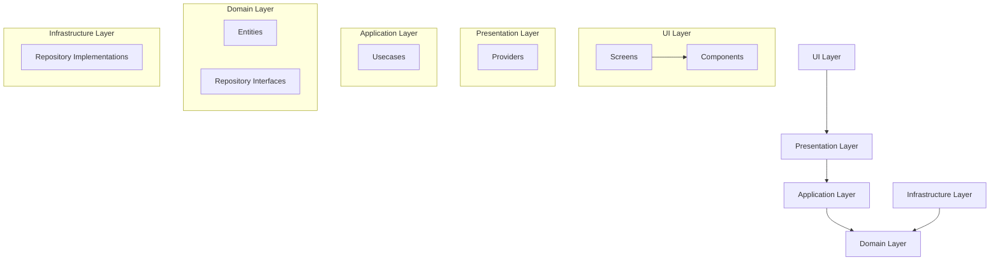
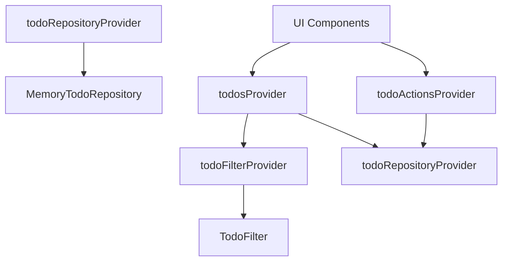

# Riverpod Todo App

Flutter로 개발된 DDD(Domain-Driven Design) 패턴을 적용한 Todo 애플리케이션입니다. 이 앱은 Riverpod을 사용하여 의존성 주입(DI)과 상태 관리를 구현했습니다.

## 프로젝트 설명

이 프로젝트는 DDD 아키텍처 원칙을 준수하여 설계되었으며, 코드의 재사용성과 테스트 용이성을 높이는 클린 아키텍처 접근 방식을 취하고 있습니다. 주요 기능으로는 Todo 항목 생성, 읽기, 수정, 삭제(CRUD)와 필터링 기능이 있습니다.

## 주요 기능

- Todo 생성, 조회, 수정, 삭제 기능 
- 모든/완료/미완료 Todo 필터링
- 메모리 기반 저장소 구현 (실제 앱에서는 로컬 데이터베이스나 API로 대체 가능)

## 기술 스택

- Flutter: UI 프레임워크
- Riverpod: 상태 관리 및 의존성 주입
- UUID: 고유 식별자 생성

## 폴더 구조

DDD 아키텍처에 맞춰 다음과 같은 폴더 구조로 구성되어 있습니다:

```
lib/
  ├── application/        # 유스케이스 레이어
  │   └── usecases/       # 비즈니스 로직 구현 (유스케이스)
  │       └── todo_usecase.dart
  │
  ├── domain/             # 도메인 레이어
  │   ├── entities/       # 엔티티 (비즈니스 모델)
  │   │   └── todo.dart
  │   └── repositories/   # 리포지토리 인터페이스
  │       └── todo_respository.dart
  │
  ├── infrastructure/     # 인프라 레이어
  │   └── repositories/   # 리포지토리 구현체
  │       └── memory_todo_repository.dart
  │
  ├── presentation/       # 프레젠테이션 레이어
  │   └── providers/      # Riverpod 프로바이더
  │       └── todo_provider.dart
  │
  ├── ui/                 # UI 레이어
  │   ├── components/     # 재사용 가능한 UI 컴포넌트
  │   │   └── todo_item.dart
  │   └── screens/        # 앱 화면
  │       └── todo_screen.dart
  │
  └── main.dart           # 앱 진입점
```

## 아키텍처 설명

### DDD (Domain-Driven Design) 아키텍처

이 프로젝트는 다음 레이어로 구성된 DDD 아키텍처를 따릅니다:

1. **도메인 레이어 (Domain Layer)**
   - 비즈니스 모델(엔티티)과 비즈니스 규칙 정의
   - 리포지토리 인터페이스 정의 (구현은 포함하지 않음)
   - 비즈니스 로직의 핵심이며 다른 계층에 의존하지 않음

2. **애플리케이션 레이어 (Application Layer)**
   - 유스케이스 구현
   - 도메인 레이어의 엔티티와 리포지토리를 사용하여 애플리케이션의 비즈니스 로직 구현
   
3. **인프라 레이어 (Infrastructure Layer)**
   - 도메인 레이어에 정의된 리포지토리 인터페이스의 구현체
   - 외부 데이터 소스와의 통신 담당 (이 앱에서는 인메모리 저장소로 구현)

4. **프레젠테이션 레이어 (Presentation Layer)**
   - Riverpod 프로바이더를 사용하여 상태 관리 및 의존성 주입
   - UI와 비즈니스 로직 간의 연결 역할

5. **UI 레이어 (UI Layer)**
   - 사용자 인터페이스 구현
   - 프레젠테이션 레이어의 프로바이더를 통해 데이터를 받아 화면에 표시

### 아키텍처 다이어그램



## Riverpod 프로바이더 구조

이 앱에서는 Riverpod을 사용하여 다음과 같은 의존성 주입 및 상태 관리를 구현했습니다:



### 주요 프로바이더 역할

1. **todoRepositoryProvider**
   - TodoRepository 구현체(MemoryTodoRepository)를 제공
   - 앱 전체에서 단일 인스턴스를 공유 (싱글톤 패턴)

2. **todoFilterProvider**
   - 현재 선택된 필터 상태 관리 (StateProvider)
   - UI에서 필터 변경시 상태 업데이트

3. **todosProvider**
   - 필터에 따른 Todo 목록을 비동기적으로 제공 (FutureProvider)
   - todoRepositoryProvider와 todoFilterProvider 변경 시 자동 갱신

4. **todoActionsProvider**
   - Todo CRUD 작업을 수행하는 메서드 제공
   - 작업 수행 후 todosProvider 갱신하여 UI 업데이트

## 앱 사용 흐름

1. 사용자가 UI에서 액션 수행 (Todo 추가, 수정, 삭제 등)
2. UI는 todoActionsProvider를 통해 해당 액션 메서드 호출
3. 액션 메서드는 관련 유스케이스 호출
4. 유스케이스는 리포지토리를 통해 데이터 처리
5. 액션 완료 후 todosProvider 갱신
6. UI는 변경된 todosProvider 데이터 감지하여 화면 업데이트

## 실행 방법

1. Flutter 환경 설정이 완료되었는지 확인하세요.
2. 프로젝트를 클론합니다.
3. 필요한 패키지 설치:
   ```
   flutter pub get
   ```
4. 앱 실행:
   ```
   flutter run
   ```

## 확장 가능성

- 현재는 메모리 기반 저장소를 사용하고 있지만, 실제 앱에서는 Hive, SQLite 등의 로컬 데이터베이스나 REST API 등으로 대체 가능합니다.
- 새로운 기능이나 엔티티 추가 시 기존 아키텍처를 따라 확장 가능합니다.